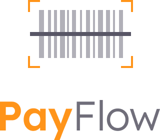
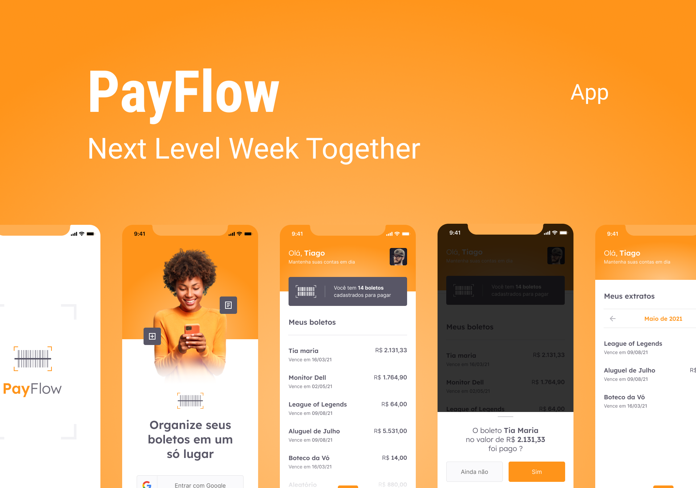
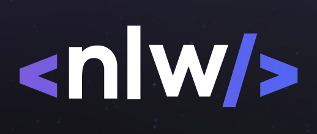

<p align="center">
  
</p>

<p align="center">
    
    
  
</p>

<h2 align="center">Topics 📋</h2>

   <p>

   - [About 📖](#About-)
   - [Disclaimer ⚠️ ](#Disclaimer-)
   - [Layout 🎨](#Layout-)
   - [Files on Notion 📋](#Files-)
   - [How to use 🤔](#How-)

   </p>

---

<h2 align="center">About 📖</h2>
<p>
   O projeto PayFlow foi desenvolvido na Next Level Week Together 💜💚. Nosso evento incrível que sempre traz projetos inéditos, além da intensa rotina de estudos, muitas conexões e networking, trabalho em grupo e em comunidade. <br>
   O PayFlow se trata de um app mobile feito em Flutter 💙 para Gerenciamento de Boletos, contendo recursos como o uso de câmera e galeria, Machine Leaning com MLKit, Firebase Core e SignIn, Animações e Estilizações Personalizadas, entre vários outros pontos, como o uso do SharedPreferences. <br>
</p>

---

<h2 align="center">Disclaimer ⚠️ </h2>

<p>
The iOS App, not working because have a incompatibility with Firebase Core ^1.1.0 and Google ML Kit ^0.6.0 packages, see <a href="https://github.com/bharat-biradar/Google-Ml-Kit-plugin/issues/27">this issue</a> and <a href="https://issuetracker.google.com/issues/188452839">this on issue tracker</a> to stay tunned about that.

   ```
   - Flutter version used:
      Channel dev, 2.3.0-24.0.pre
   ```

</p>

---

<h2 align="center">Layout 🎨</h2>

   <p align="center">
      
   </p>

   <p align="center">
      O Layout foi desenvolvido por <a href="https://instagram.com/tiagoluchtenberg">Tiago Luchtenberg</a>, e você pode acessá-lo no Figma:

   - <a href="https://www.figma.com/file/kLK7FYnWKMoN68sQXcSniu/PayFlow">Mobile</a> 📱
   </p>

---

<h2 align="center">Files on Notion 📋</h2>

- [Trail | Flutter](https://www.notion.so/NLW-Together-Conte-dos-complementares-ae22125e899549efb2d4e360b5ee5ca3) 🚀

---

<h2 align="center">How to use 🤔</h2>

   ```
   - Clone this repo:
   $ git clone https://github.com/leelavescosta/payflow.git

   - Enter on directory:
   $ cd payflow

   - Install dependencies:
   $ flutter pub get

   - Run App:
   $ flutter run
   ```

---
   >This project has made by 💜 on #NextLevelWeekTogether for **[Rocketseat  💜🚀](https://rocketseat.com.br/)**.

   <p align="center">
      
   </p>